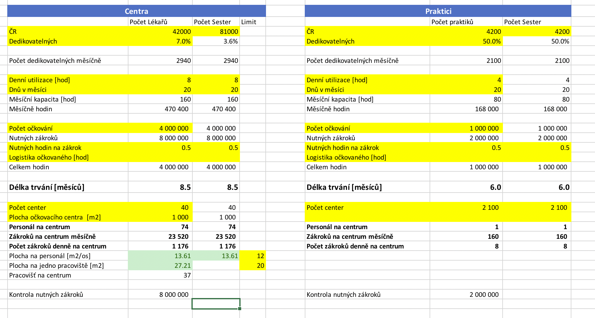

# Plán očkování ČR 2020

Frustrace z neschopnosti českého státu dát občanům jasnou informaci o plánu očkování proti Covid19 mne vedla k vytvoření opravdu hloupého modelu, jehož cílem bylo vypočítat délku celkového proočkování 50% populace ČR.

Model je hloupý a velmi naivní, jeho vstupními parametry jsou:
- počet dostupných lékařů a sester k očkování
- počet očkovacích center
- délka očkování na jednu osobu
- počet nutných očkovacích akcí
- utilizace lékařů a sester, měsíční fond pracovní doby

[Excel sheet](plan-ockovani-CR-2021.xlsx) modelující prostou statistiku logistiky očkování má dvě části.
1. model s očkovacími centry v krajích
2. model s praktiky

Výsledkem je:
- celková délka očkování v měsících
- denní počet zákroků na centrum či ordinaci
- v případě modelu s očkovacícmi centry také dopočet pracovní plochy nutné pro jedno očkovací pracoviště.

Nechť to zemi pomůže nebo upadne v zapomnění.

Modelové výsledky:

